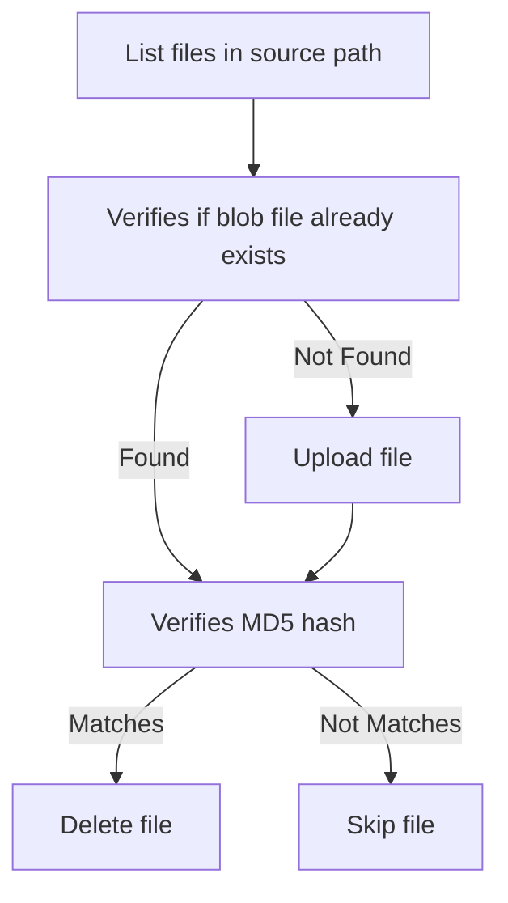

# Blobify

Blobify is a .NET Global tool that archives (moves) files from a local folder to Azure Blob Storage container.

## Obtain

```bash
dotnet tool install -g Blobify
```

## Usage

    blobify archive <inputpath> <azureStorageAccount> <azureStorageAccountContainer> [OPTIONS]

### Example

    blobify archive inputpath storageaccountname

### Arguments

    <inputpath>                       Input path
    <azureStorageAccount>             Azure Storage Account Name
    <azureStorageAccountContainer>    Azure Storage Account Container Name

### Options
    -h, --help               Prints help information
        --azure-tenant-id    Azure Tentant ID to sign into
        --file-pattern       Local file pattern to match


## Authentication

By default it'll try authenticate using the [DefaultAzureCredential](https://learn.microsoft.com/en-us/dotnet/api/azure.identity.defaultazurecredential?view=azure-dotnet) which tries to authorize in the following order based on your environment.

1. [EnvironmentCredential](https://learn.microsoft.com/en-us/dotnet/api/azure.identity.environmentcredential?view=azure-dotnet)
1. [WorkloadIdentityCredential](https://learn.microsoft.com/en-us/dotnet/api/azure.identity.workloadidentitycredential?view=azure-dotnet)
1. [ManagedIdentityCredential](https://learn.microsoft.com/en-us/dotnet/api/azure.identity.managedidentitycredential?view=azure-dotnet)
1. [SharedTokenCacheCredential](https://learn.microsoft.com/en-us/dotnet/api/azure.identity.sharedtokencachecredential?view=azure-dotnet)
1. [VisualStudioCredential](https://learn.microsoft.com/en-us/dotnet/api/azure.identity.visualstudiocredential?view=azure-dotnet)
1. [VisualStudioCodeCredential](https://learn.microsoft.com/en-us/dotnet/api/azure.identity.visualstudiocodecredential?view=azure-dotnet)
1. [AzureCliCredential](https://learn.microsoft.com/en-us/dotnet/api/azure.identity.azureclicredential?view=azure-dotnet)
1. [AzurePowerShellCredential](https://learn.microsoft.com/en-us/dotnet/api/azure.identity.azurepowershellcredential?view=azure-dotnet)
1. [AzureDeveloperCliCredential](https://learn.microsoft.com/en-us/dotnet/api/azure.identity.azuredeveloperclicredential?view=azure-dotnet)
1. [InteractiveBrowserCredential](https://learn.microsoft.com/en-us/dotnet/api/azure.identity.interactivebrowsercredential?view=azure-dotnet)

### Using EnvironmentCredential

1. Set the environment variable `AZURE_TENANT_ID` to the tenant ID (found in the `App Registration` overview for your app).
1. Set the environment variable `AZURE_CLIENT_ID` to the client ID (found in the `App Registration` overview for your app).
1. Set the environment variable `AZURE_CLIENT_SECRET` to the secret noted earlier.
1. Set the environment variable `AZURE_AUTHORITY_HOST` to `https://login.microsoftonline.com/`.

## Tool flow

